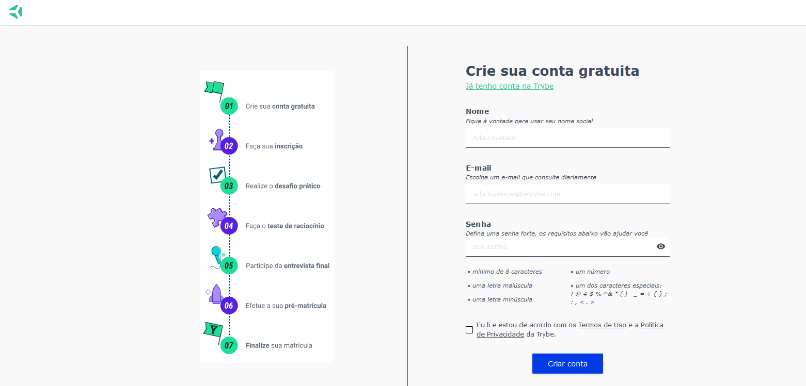

# Dinâmica em Dupla

## Habilidades

Nesse projeto, verificamos se você é capaz de:

- Criar formulários em HTML;
- Utilizar CSS Flexbox para criar layouts flexíveis;
- Criar regras CSS específicas para serem aplicadas a dispositivos móveis;
- Construir páginas que alteram o seu layout de acordo com a orientação da tela;

---
## Entregáveis

Você deverá criar um Pull Request neste repositório.
#### O que deverá ser desenvolvido

Neste projeto, você irá desenvolver a página de cadastro da Escola de Tecnólogia Trybe, em que as pessoas estudantes poderão se cadastrar no processo seletivo da escola.

#### Data de entrega

- Projeto em dupla;
- Data de entrega: `08/11/2021 - 09:00h`
 

#### Instruções para entregar seu projeto

**Antes de começar a desenvolver:**

**Esse projeto tem um fluxo um pouco diferente dos outros. Os passos 1 a 6 devem ser feitos por uma pessoa da dupla (a que vai criar a branch de trabalho). A outra pessoa deve fazer apenas o passo 1 e depois mudar para a branch criada pela primeira pessoa.**

Exemplo: `git checkout rod-dinamica-dupla`

  1. Clone o repositório
   - `git clone git@github.com:raugusto96/Dinamica-Dupla.git`
   - Entre na pasta do repositório que você acabou de clonar:
     - `cd dinamica-dupla`
  2. Instale as dependêcias e inicialize o projeto
   - Instale as dependências
     - Exemplo: `npm install`
  3. Crie uma branch a partir da branch `main`
  - Verifique que você está na branch `main`
    - Exemplo: `git branch`
  - Senão estiver, mude para a branch `main`
    - Exemplo: `git checkout main`
  - Agora, crie uma branch onde você vai guardar os `commits` do seu projeto
    - Você deve criar uma branch no seguinte formato: `nome-sobrenome-dinamica-dupla`
    - Exemplo: `git checkout -b rod-dinamica-dupla`
  4. Crie na raiz do projeto os arquivos que você precisará desenvolver:
  - Verifique que você está na raiz do projeto
    - Exemplo: `pwd` -> o retorno vai ser algo tipo /Users/rod/code/**dinamica-dupla**
  - Crie os arquivos index.html, style.css, script.js
    - Exemplo: `touch index.html style.css script.js`
  5. Adicione as mudanças ao *stage* do Git e faça um `commit`
   - Verifique que as mudanças ainda não estão no *stage*
     - Exemplo: `git status` *(devem aparecer listados em vermelho os novos arquivos)*
   - Adicione o novo arquivo ao *stage* do Git
     - Exemplo: `git add index.html`
   - Faça um `commit` desse novo arquivo
     - Exemplo: `git commit -m 'iniciando o projeto. :rocket:'`
  6. Adicione a sua branch com o novo `commit` ao repositório remoto
   - Usando o exemplo anterior: `git push -u origin rod-dinamica-dupla`
  7. Crie um novo `Pull Request` **(PR)**
   - Vá até a página de *Pull Requests* do repositório no GitHub
   - Clique no botão verde *"New pull request"*
   - Clique na caixa de seleção *"Compare"* e escolha a sua branch **com atenção**
   - Clique no botão verde *"Create pull request"*
   - Adicione uma descrição para o *Pull Request*, um título claro que o identifique, e clique no botão verde *"Create pull request"*
   - **Não se preocupe em preencher mais nada por enquanto!**
   - Volte até a página de *Pull Requests* do repositório e confira que o seu *Pull Request* está criado

#### Durante o desenvolvimento

- Faça `commits` das alterações que fizer no código regularmente;
- Lembre-se de sempre após um *(ou alguns)* `commits` atualizar o repositório remoto;
- Os comandos que você utilizará com mais frequencia são:
  i. `git status` *(para verificar o que está em vermelho - fora do stage - e o que está em verde - no stage);*
  ii. `git add` *(para adicionar arquivos ao stage do Git);*
  iii. `git commit` *(para criar um commit com os arquivos que estão no stage do Git);*
  iv. `git push -u nome-da-branch` *(para enviar o commit para o repositório remoto na primeira vez que fizer o `push` de uma nova branch);*
  v. `git push` *(para enviar o commit para o repositório remoto após o passo anterior).*

---
## Como desenvolver

Você irá desenvolver este projeto em **dupla** e é fundamental que siga as instruções do repositório.

Todos os requisitos tem como base a página a seguir, que representa um formulário de cadastro da Escola de Tecnólogia da Trybe. Use a imagem do site como base e respeite o posicionamento dos elementos, mas quanto às cores e elementos de design que não interfiram nesses aspectos sinta-se livre para deixar a sua criatividade fluir!




---
## ESLint e Stylelint

Para garantir a qualidade do código, vamos utilizar neste projeto os linters `ESLint` e `Stylelint`. Assim o código estará alinhado com as boas práticas de desenvolvimento, sendo mais legível e de fácil manutenção! Para rodá-los localmente no projeto, execute os comandos abaixo:

```
npm run lint
npm run lint:styles
```
⚠️ Os avaliadores só serão rodados localmente ⚠️

---
## Requisitos do projeto

**Caso você faça o downlaod de bibliotecas externas, utilize o diretório *(a partir da raiz do projeto)* para colocar os arquivos *(.css, .js, etc...)* baixados.**

---
## Depois de terminar o desenvolvimento

**A pessoa dona da branch deve garantir que o último commit nessa branch é seu. Pode ser feita alguma alteração que não afete o cumprimento dos requisitos para realizar o commit.**

A outra pessoa integrante da dupla deve criar uma nova `branch` a partir da `branch` de trabalho (a primeira branch criada pela equipe). Exemplo:

1. Use `git branch` para ter certeza que está na branch de trabalho;
2. Caso não esteja use `git checkout rod-dinamica-dupla` para trocar de `branch`;
3. Use `git checkout -b joaozinho-dinamica-dupla` para criar uma nova branch a partir da branch anterior (`rod-dinamica-dupla`);

**Garanta que o último commit da branch é de autoria da pessoa dona de cada branch. Novamente pode ser feita alguma alteração que não afete o cumprimento dos requisitos para realizar o commit.**

1. Adicione sua branch com o novo `commit` ao repositório remoto
   - Usando o exemplo anterior: `git push -u origin joaozinho-dinamica-dupla`
2. Crie um novo `Pull Request` **(PR)**
  - Vá até a página de *Pull Requests* do repositório no GitHub
  - Clique no botão verde *"New pull request"*
  - Clique na caixa de seleção *"Compare"* e escolha a sua branch **com atenção**
  - Clique no botão verde *"Create pull request"*
  - Adicione uma descrição para o *Pull Request*, um título claro que o identifique, e clique no botão verde *"Create pull request"*
  - **Não se preocupe em preencher mais nada por enquanto!**
  - Volte até a página de *Pull Requests* do repositório e confira que o seu *Pull Request* está criado